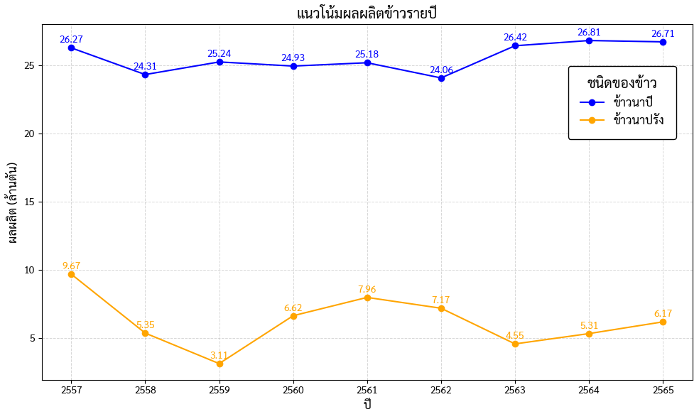
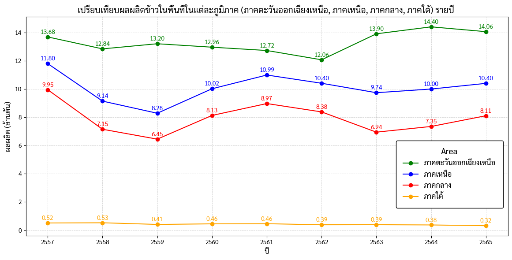
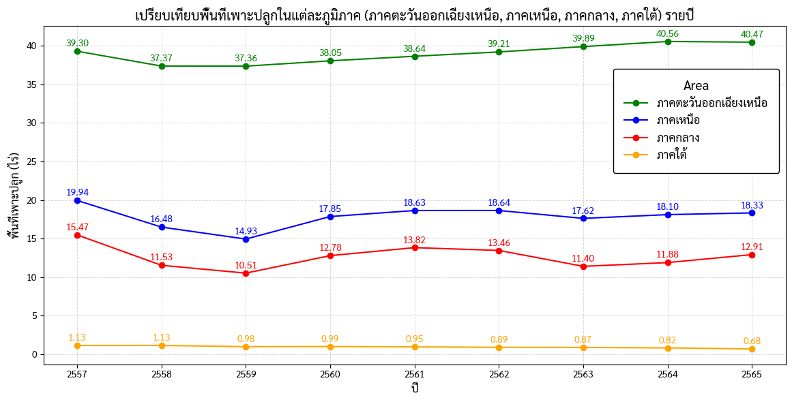
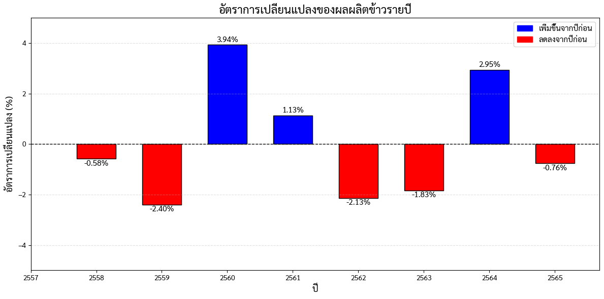
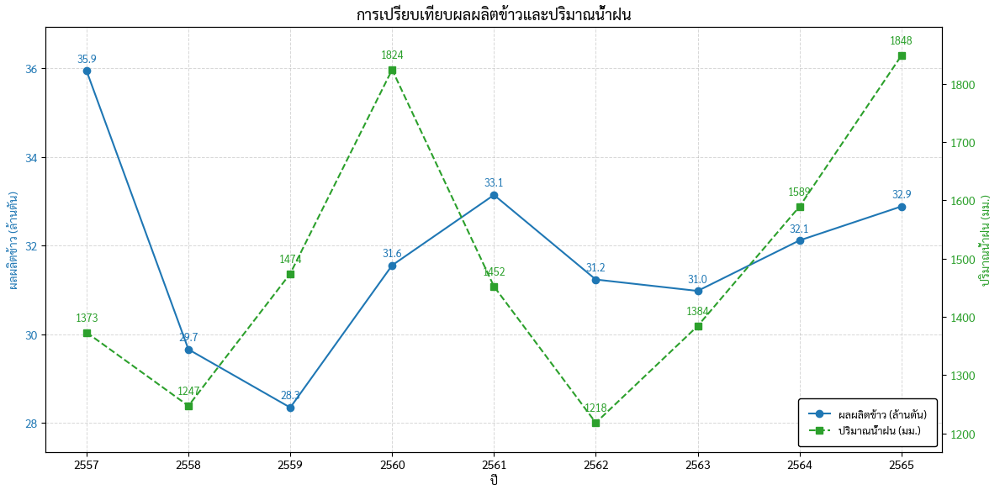
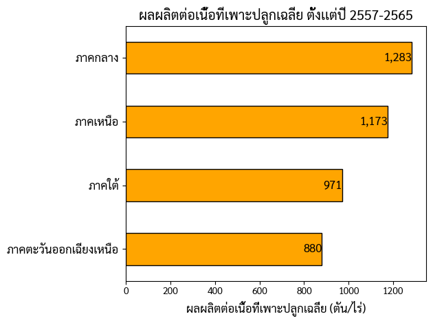
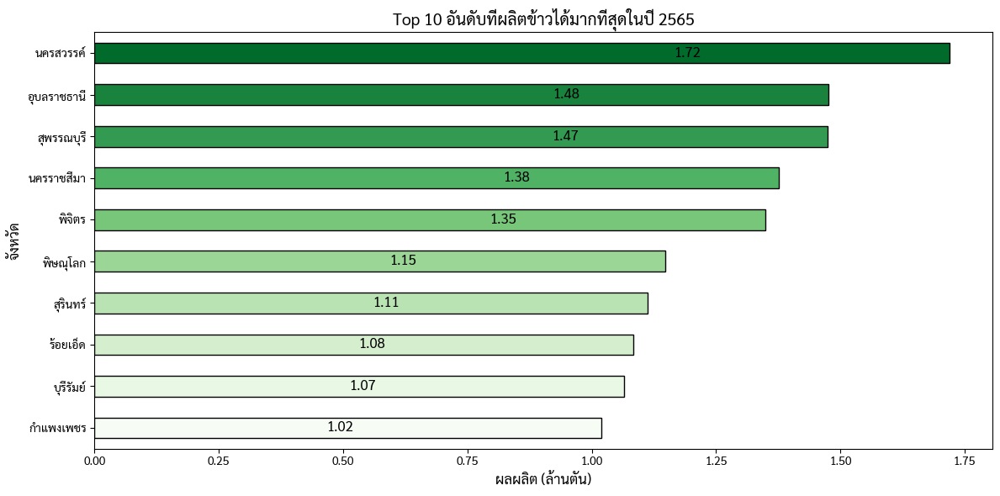

# ปริมาณการผลิตข้าวในประเทศไทย

**miniProjectDADS5001 :**
โครงงานนี้เป็นส่วนหนึ่งของวิชา Data Analytics and Data Science Tools and Programming (DADS5001)

## Table of Contents

1. [📌 Introduction](#introduction)
2. [📊 Part 1: สถานการณ์การผลิตข้าวในประเทศไทยในอดีตและปัจจุบัน](#part-1-สถานการณ์การผลิตข้าวในประเทศไทยในอดีตและปัจจุบัน)
3. [🔎 Part 2: การวิเคราะห์ปัจจัยที่มีผลต่อการผลิตข้าว](#part-2-การวิเคราะห์ปัจจัยที่มีผลต่อการผลิตข้าว)
4. [🗺️ Part 3: การวิเคราะห์ข้อมูลการผลิตข้าวตามพื้นที่](#part-3-การวิเคราะห์ข้อมูลการผลิตข้าวตามพื้นที่)
5. [📌 Summary: สรุปผล](#summary-สรุปผล)
6. [📂 Dataset](#dataset)
7. [⚠️ Limitation](#limitation)
8. [💻 Authors](#authors)

## Introduction

🌾 การผลิตข้าวถือเป็นหัวใจสำคัญของภาคการเกษตรไทย ทั้งในด้านเศรษฐกิจ ความมั่นคงทางอาหาร และวิถีชีวิตของเกษตรกร ข้าวไม่เพียงแต่เป็นพืชเศรษฐกิจหลักของประเทศเท่านั้น แต่ยังเป็นสินค้าส่งออกที่สำคัญ และมีบทบาทในการสร้างรายได้ให้กับเกษตรกรหลายล้านครัวเรือน

ข้อมูลการผลิตข้าวในระดับประเทศและระดับภูมิภาคช่วยให้สามารถมองเห็นแนวโน้มและการเปลี่ยนแปลงของผลผลิตในแต่ละช่วงปีได้อย่างชัดเจน โดยเฉพาะการเปรียบเทียบระหว่างภาคเหนือ ภาคตะวันออกเฉียงเหนือ ภาคกลาง และภาคใต้ ทำให้เห็นถึงความแตกต่างทางภูมิศาสตร์ ทรัพยากรน้ำ ระบบชลประทาน และลักษณะทางเศรษฐกิจของแต่ละพื้นที่

จากการวิเคราะห์ข้อมูลในช่วงปี 2557 ถึง 2565 เราสามารถระบุแนวโน้มการเปลี่ยนแปลงของผลผลิตข้าวในแต่ละภูมิภาค รวมถึงประเมินปัจจัยที่ส่งผลกระทบ เช่น ปริมาณน้ำฝน ภัยธรรมชาติ หรือการเปลี่ยนแปลงทางนโยบาย ซึ่งล้วนมีผลต่อความสามารถในการผลิตข้าวของประเทศอย่างมีนัยสำคัญ

## Part 1: สถานการณ์การผลิตข้าวในประเทศไทยในอดีตและปัจจุบัน

ตามข้อมูลที่ได้จาก GOVERNMENT DATA CATALOG SMART PLUS ได้เก็บข้อมูลรวบรวมยอดการผลิตข้าวตั้งเเต่ปี 2557 จนถึง 2565

.png>)

(กราฟที่ 1)  แนวโน้มผลผลิตข้าวรวม (ข้าวนาปี + ข้าวนาปรัง) รายปี

ผลผลิตข้าวมีความผันผวนในช่วงปี 2557–2561 โดยลดลงในปี 2558–2559 ก่อนจะเพิ่มขึ้นสูงในปี 2561 ที่ประมาณ 33 ล้านตัน หลังจากนั้น แนวโน้มเริ่มทรงตัวอยู่ที่ราว 30 ล้านตันต่อปีในช่วงปี 2563–2565

**สรุปกราฟแนวโน้มผลผลิตข้าวนาปีและข้าวนาปรัง**

(กราฟที่ 2) แนวโน้มผลผลิตข้าวรายปี

จากกราฟจะเห็นว่าข้าวนาปีมีผลผลิตรวมสูงกว่าข้าวนาปรัง เนื่องจากข้าวนาปีเป็นการเพาะปลูกในช่วงฤดูฝนของประเทศไทย เกษตรกรส่วนใหญ่จึงเลือกปลูกข้าวในฤดูกาลนี้ ทำให้ข้าวนาปีมีการผลิตรวมมากกว่า ข้าวนาปรัง ซึ่งข้าวนาปรังจะปลูกได้หลายรอบในหนึ่งปี แต่จำนวนผู้ปลูกยังมีน้อยกว่าข้าวนาปี

**เปรียบเทียบผลผลิตข้าวในแต่ละภูมิภาครายปี**

(กราฟที่ 3) เปรียบเทียบผลผลิตข้าวในแต่ละภูมิภาครายปี

ภาคตะวันออกเฉียงเหนือมีผลผลิตข้าวสูงที่สุดในทุกปี โดยเฉพาะปี 2564 และ 2565 ที่มียอดเกิน 14 ล้านตัน รองลงมาคือภาคเหนือซึ่งมีแนวโน้มผลผลิตค่อนข้างคงที่ ส่วนภาคกลางจะมีผลผลิตสูงในปี 2557 แต่ลดลงในช่วงปี 2559 และฟื้นตัวในปี 2565 ขณะที่ภาคใต้มีผลผลิตต่ำสุดทุกปี อยู่ในช่วงเพียง 0.3–0.5 ล้านตัน แสดงให้เห็นว่าภาคตะวันออกเฉียงเหนือเป็นแหล่งผลิตข้าวหลักของประเทศ ตามด้วยภาคเหนือและภาคกลาง ส่วนภาคใต้มีบทบาทน้อยที่สุดในการผลิตข้าว

**เปรียบเทียบพื้นที่เพาะปลูกในแต่ละภูมิภาครายปี**

(กราฟที่ 4) เปรียบเทียบพื้นที่เพาะปลูกในแต่ละภูมิภาครายปี

ภาคตะวันออกเฉียงเหนือมีพื้นที่เพาะปลูกข้าวมากที่สุด ประมาณ 40 ล้านไร่ต่อปี ส่งผลให้เป็นภูมิภาคที่มีผลผลิตข้าวสูงที่สุดของประเทศ ขณะที่ภาคเหนือและภาคกลางมีพื้นที่เพาะปลูกใกล้เคียงกัน อยู่ระหว่าง 14–20 ล้านไร่ต่อปี ส่วนภาคใต้มีพื้นที่เพาะปลูกน้อยที่สุดและมีแนวโน้มลดลง แต่ก็ยังสามารถรักษาระดับผลผลิตไว้ได้ แม้ผลผลิตจะน้อยเมื่อเทียบกับภูมิภาคอื่น

> 📌 **ข้อสังเกต:** จากกราฟที่ 3 และกราฟที่ 4 แสดงให้เห็นว่า “พื้นที่เพาะปลูก” มีความสัมพันธ์โดยตรงกับ “ปริมาณผลผลิต” ซึ่งสามารถนำไปใช้วางแผนด้านการเกษตรและจัดสรรทรัพยากรในอนาคตได้อย่างเหมาะสม

**อัตราการเปลี่ยนแปลงของผลผลิตข้าวในแต่ละปี**

(กราฟที่ 5) อัตราการเปลี่ยนแปลงของผลผลิตข้าวรายปี

กราฟแสดงอัตราการเปลี่ยนแปลงของผลผลิตข้าวในแต่ละปี 2558–2565 โดยพบว่ามีความผันผวนในหลายช่วง โดยเฉพาะปี 2560 ที่ผลผลิตเพิ่มขึ้นสูงสุดที่ 3.94% และปี 2564 ที่เพิ่มขึ้น 2.95% ขณะที่ปี 2559 และ 2562 เป็นปีที่ผลผลิตลดลงมากที่สุดที่ -2.40% และ -2.13% ตามลำดับ แสดงให้เห็นว่าปัจจัยภายนอก เช่น สภาพอากาศ หรือปริมาณน้ำฝน มีผลต่อประสิทธิภาพการผลิตข้าวในแต่ละปีอย่างชัดเจน

## Part 2: การวิเคราะห์ปัจจัยที่มีผลต่อการผลิตข้าว

### 2.1 ปัจจัยภายนอก (ปริมาณน้ำฝน)

(กราฟที่ 6) การเปรียบเทียบผลผลิตข้าวและปริมาณน้ำฝน

กราฟนี้แสดงความสัมพันธ์ระหว่างปริมาณผลผลิตข้าว (เส้นสีน้ำเงิน) และปริมาณน้ำฝน (เส้นสีเขียว) ตั้งแต่ปี 2557 ถึง 2565 จะเห็นว่าในบางปี เช่น ปี 2560 และ 2565 ที่มีปริมาณน้ำฝนสูง ผลผลิตข้าวมีแนวโน้มเพิ่มขึ้นเช่นกัน ขณะที่ในปี 2558 และ 2562 ที่ปริมาณน้ำฝนลดลง ผลผลิตข้าวก็ลดลงด้วย แสดงให้เห็นถึงความสัมพันธ์เชิงบวกระหว่างปริมาณน้ำฝนและผลผลิตข้าว โดยเฉพาะข้าวนาปีที่พึ่งพาน้ำฝนในการเจริญเติบโตเป็นหลัก

### 2.2 ปัจจัยด้านเนื้อที่เพาะปลูก

(กราฟที่ 7) ผลผลิตต่อเนื้อที่เพาะปลูกเฉลี่ยตั้งแต่ปี 2557-2565

กราฟนี้แสดงผลผลิตข้าวเฉลี่ยต่อเนื้อที่เพาะปลูก (ตัน/ไร่) ของแต่ละภูมิภาคในช่วงปี 2557–2565 พบว่า ภาคกลาง มีประสิทธิภาพการผลิตสูงที่สุดเฉลี่ยอยู่ที่ 1,283 ตัน/ไร่ รองลงมาคือ ภาคเหนือ ที่ 1,173 ตัน/ไร่ ส่วนภาคใต้และภาคตะวันออกเฉียงเหนือ มีผลผลิตเฉลี่ยต่ำกว่า โดยภาคอีสานต่ำที่สุดที่ 880 ตัน/ไร่ สะท้อนให้เห็นถึงความแตกต่างด้านประสิทธิภาพการเพาะปลูกในแต่ละภูมิภาค ซึ่งอาจเกิดจากปัจจัยด้านสภาพดิน น้ำ เทคโนโลยีการผลิต และระบบชลประทาน

## Part 3: การวิเคราะห์ข้อมูลการผลิตข้าวตามพื้นที่

(กราฟที่ 8) Top 10 อันดับที่ผลิตข้าวได้มากที่สุดในปี 2565

กราฟนี้แสดง 10 อันดับจังหวัดที่มีผลผลิตข้าวมากที่สุดในปี 2565 โดยจังหวัดนครสวรรค์มีผลผลิตข้าวสูงที่สุดที่ 1.72 ล้านตัน รองลงมาคืออุบลราชธานีและสุพรรณบุรีที่มีผลผลิตใกล้เคียงกันที่ 1.48 และ 1.47 ล้านตัน ตามลำดับ ส่วนจังหวัดอื่น ๆ เช่น พิษณุโลก สุรินทร์ และบุรีรัมย์ มีผลผลิตประมาณ 1 ล้านตัน แสดงให้เห็นว่าจังหวัดในภาคกลางและภาคตะวันออกเฉียงเหนือเป็นพื้นที่หลักในการผลิตข้าวของประเทศในปีดังกล่าว

## Summary: สรุปผล

📌 จากการวิเคราะห์ข้อมูลการผลิตข้าวของประเทศไทยในช่วงปี 2557–2565 พบว่า ภาคตะวันออกเฉียงเหนือเป็นภูมิภาคที่มีผลผลิตข้าวมากที่สุด รองลงมาคือภาคเหนือและภาคกลาง ในขณะที่ภาคใต้มีผลผลิตน้อยที่สุด ซึ่งแม้จะมีพื้นที่น้อยแต่ยังสามารถรักษาผลผลิตไว้ได้ในระดับที่คงที่ ผลผลิตข้าวโดยรวมมีแนวโน้มผันผวนตามปริมาณน้ำฝน โดยเฉพาะในข้าวนาปีที่อาศัยน้ำฝนเป็นหลัก และแม้ภาคกลางจะมีพื้นที่เพาะปลูกน้อยกว่าภาคอีสาน แต่มีผลผลิตเฉลี่ยต่อไร่สูงสุด แสดงให้เห็นถึงความแตกต่างด้านประสิทธิภาพการผลิตของแต่ละภูมิภาค ทั้งนี้ ข้อมูลเหล่านี้สามารถนำไปใช้วางแผนเชิงนโยบายและพัฒนาการเกษตรได้อย่างมีประสิทธิภาพ

## Dataset

📊 Resources:

1. ปริมาณการผลิตข้าว :
   https://gdcatalog.go.th/dataset/gdpublish-dataoae1104

2. รายงานสถานการณ์น้ำประเทศไทย ปี 2565 :
   https://www.thaiwater.net/uploads/contents/current/YearlyReport2022/rain2.html

## Limitation

การวิเคราะห์นี้ยังสามารถขยายผลได้เพิ่มเติมหากมีข้อมูลเกี่ยวกับ **ราคาข้าวแต่ละประเภท** 💰 ซึ่งจะช่วยให้สามารถประเมินความคุ้มค่าทางเศรษฐกิจของการผลิตข้าวในแต่ละพื้นที่ได้ดีขึ้น นอกจากนี้ หากมีข้อมูลเกี่ยวกับ **ต้นทุนการผลิตและกำไรสุทธิของแต่ละภูมิภาค** 📈 ก็จะช่วยให้สามารถเปรียบเทียบศักยภาพในการทำกำไรของแต่ละภูมิภาคได้อย่างแม่นยำยิ่งขึ้น อีกทั้ง **ปัจจัยทางเศรษฐกิจและนโยบายภาครัฐ** 🏛️ เช่น นโยบายสนับสนุนเกษตรกร ราคาประกันข้าว หรือมาตรการควบคุมการส่งออก ก็เป็นปัจจัยสำคัญที่อาจส่งผลต่อปริมาณและประสิทธิภาพการผลิตข้าวในระยะยาว 🚜🌾

## Authors

This project was developed by:

- ☕ [6710422011 นายณัฐวัฒน์ สวัสดีนฤนาท](https://github.com/Natthawat-saw)

- 🍕 [6710422027 นางสาวชลดา ทับเจริญ](https://github.com/Chollada-Grape)

- 🥚 [6710422031 นายนันทวัฒน์ ทศรฐ](https://github.com/DeepVader)

---

🚀 **ขอบคุณที่ติดตามอ่านจนจบ!** หวังว่าข้อมูลนี้จะเป็นประโยชน์สำหรับการศึกษาและวางแผนนโยบายเกษตรกรรมต่อไป🌾
